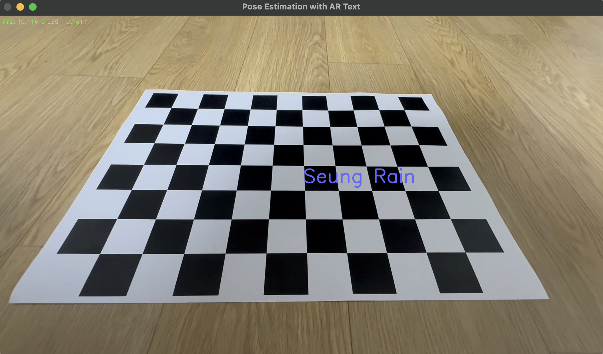

# 🎯 카메라 자세 추정 및 AR 물체 시각화(Camera Pose Visualizer)

이 프로젝트는 **체스보드 패턴을 이용한 카메라 캘리브레이션**을 통해  
내 카메라의 내부 파라미터를 추정하고, 그 결과를 바탕으로 **카메라의 자세(camera pose)**를 추정하여  
영상 속 특정 위치에 간단한 **AR 물체**(텍스트 또는 도형)를 시각화하는 프로젝트입니다.

---

## ✅ 프로젝트 개요

| 항목 | 설명 |
|------|------|
| 🔧 카메라 캘리브레이션 | `camera_calibration.py`를 통해 카메라 내부 파라미터 획득 |
| 📷 카메라 자세 추정 | OpenCV의 `findChessboardCorners()` 및 `solvePnP()` 사용 |
| 🔤 AR 텍스트 렌더링 | 체스보드 위에 "Seung Rain" 텍스트 표시 |
| 🔺 AR 도형 렌더링 | 체스보드 위에 입체 피라미드(Pyramid) 표시 |
| 🛠 사용 도구 | Python, OpenCV (외부 3D 라이브러리 사용 X) |

---

## 📂 파일 구성

| 파일명 | 설명 |
|--------|------|
| `camera_calibration.py` | 카메라의 내부 파라미터(K, 왜곡 계수 등) 계산 |
| `pose_estimation_word.py` | 체스보드 위에 **"Seung Rain"** 텍스트 표시 |
| `pose_estimation_shape.py` | 체스보드 위에 **피라미드 도형** 표시 |
| `Result(1).png` | 텍스트 AR 결과 이미지 |
| `Result(2).png` | 피라미드 AR 결과 이미지 |

---

## 📸 결과 예시

### 🔠 텍스트 표시 결과 (`pose_estimation_word.py`)


---

### 🔺 피라미드 도형 표시 결과 (`pose_estimation_shape.py`)


---

## 🚀 실행 방법

### 1. 카메라 캘리브레이션 (한 번만 수행)
체스보드 이미지 또는 영상을 이용해 카메라 내부 파라미터를 계산합니다.

### 2. 텍스트 혹은 도형 AR 실행
```bash
python pose_estimation_word.py
python pose_estimation_shape.py
